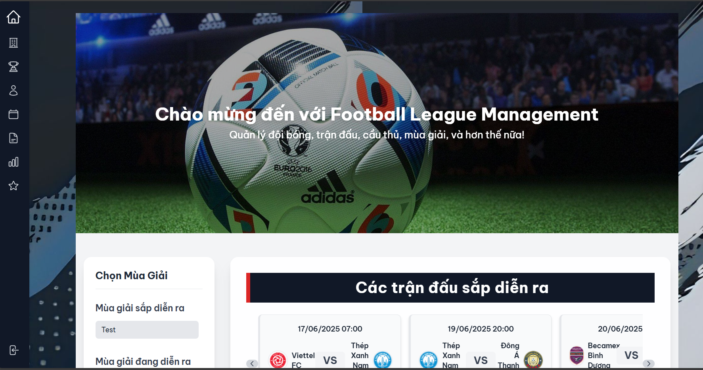
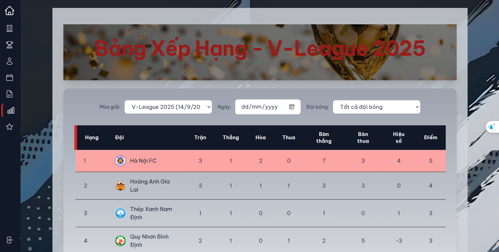
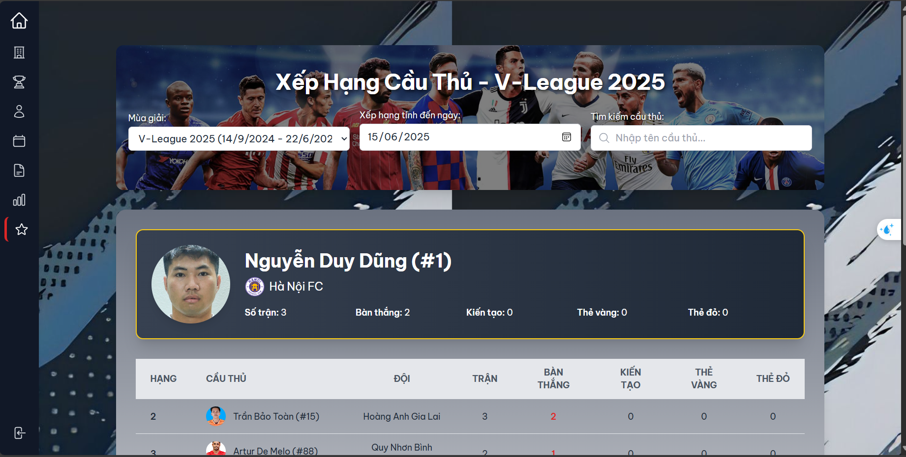
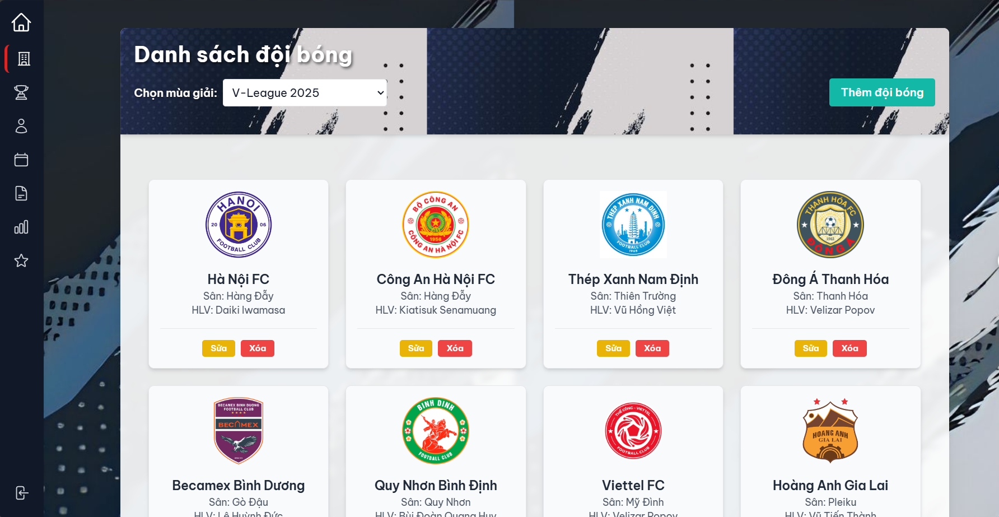
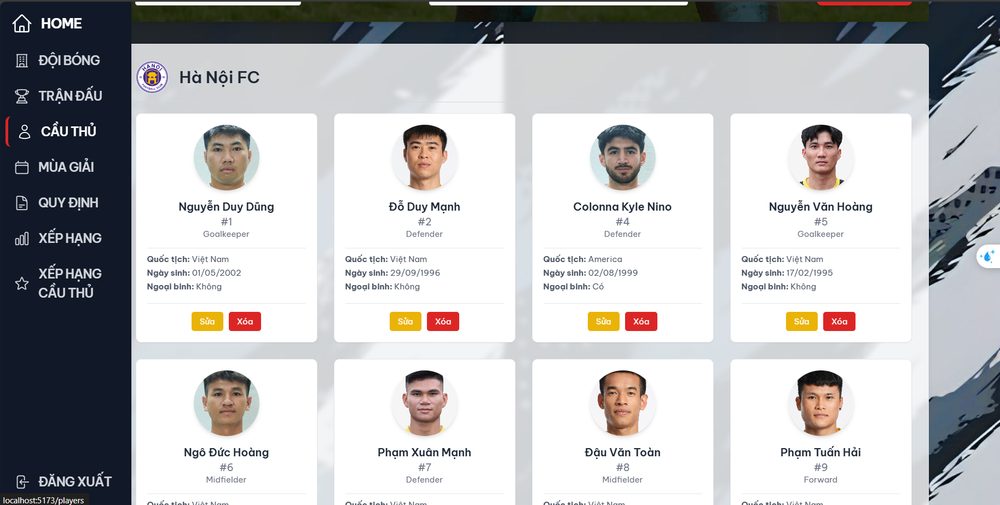
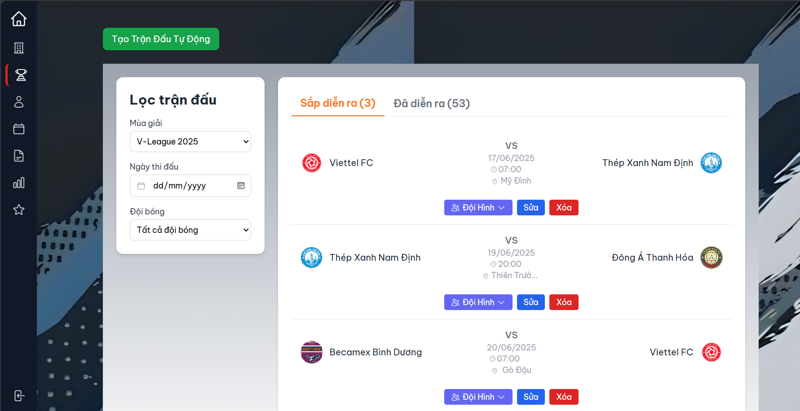
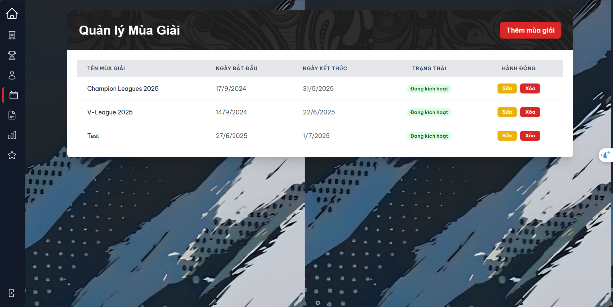
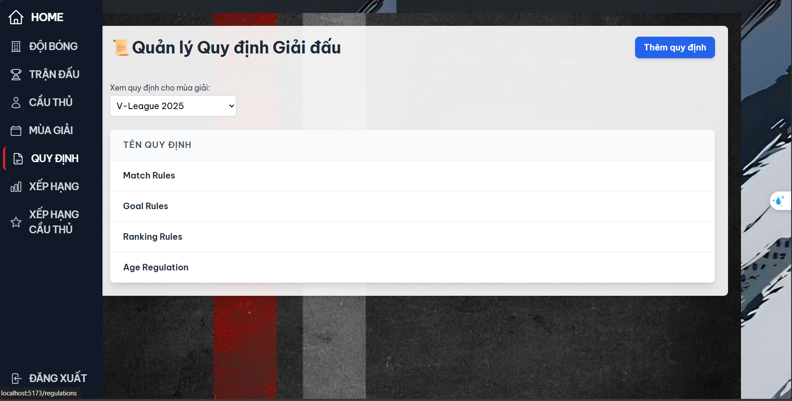

# National Football League Management System (SE104_UIT)

A full-stack web application designed to comprehensively manage a football league. This system allows administrators to handle seasons, teams, players, match schedules, results, and rankings in a detailed and automated manner.

## 📸 Application Screenshots

Here are some screenshots showcasing the main features of the application.

| Home Page | Team Ranking | Player Ranking |
| :---: | :---: | :---: |
|  |  |  |

| Team Management | Player Management | Match Management |
| :---: | :---: | :---: |
|  |  |  |

| Season Management | Regulation Management |
| :---: | :---: |
|  |  |

## ✨ Key Features

The project provides a robust set of features for league management:

-   **Season Management**: Create, update, and delete seasons with specific start and end dates.
-   **Team Management**: Add teams to a season, manage information like stadium, coach, and logo.
-   **Player Management**: Add players to teams, respecting regulations on age, maximum players per team, and maximum foreign players.
-   **Flexible Regulations**: Define rules for each season, including:
    -   Player age and quantity rules.
    -   Match format rules (e.g., number of rounds).
    -   Scoring and ranking criteria (goal difference, head-to-head, etc.).
-   **Automatic Schedule Generation**: The system can automatically create a full match schedule based on the registered teams in a season.
-   **Match Result Updates**: Update match scores and record goal details (scorer, minute, goal type).
-   **Automatic Ranking Calculation**:
    -   Team rankings are automatically updated after each match result is entered.
    -   Player rankings (top scorers) are also updated automatically.
-   **User Authentication**: Secure registration and login for administrators to perform management tasks.

## 🛠️ Technology Stack

### Backend
-   **Node.js & Express.js**: Platform and framework for building the API.
-   **MongoDB & Mongoose**: NoSQL database and ODM for data storage and modeling.
-   **JSON Web Token (JWT)**: For securing API endpoints.
-   **bcryptjs**: For password hashing.
-   **Zod**: For data validation.
-   **Swagger & YAML**: For API documentation.

### Frontend
-   **React & Vite**: Library and build tool for the user interface.
-   **Tailwind CSS**: For utility-first styling.
-   **Axios**: For making HTTP requests to the backend API.
-   **React Router**: For client-side routing.

## 🚀 Getting Started

### Prerequisites

Before you begin, ensure you have the following installed:
-   Node.js (v22.x is specified in `backend/package.json`).
-   npm or yarn
-   MongoDB
-   A code editor (like Visual Studio Code)

### Installation and Setup

1.  **Clone the repository**:
    ```bash
    git clone [https://github.com/truonghoangkhiem/QL_Giai_BD_QG_SE104_UIT.git](https://github.com/truonghoangkhiem/QL_Giai_BD_QG_SE104_UIT.git)
    cd QL_Giai_BD_QG_SE104_UIT
    ```

2.  **Backend Setup**:
    -   Navigate to the `backend` directory: `cd backend`
    -   Install dependencies: `npm install`
    -   Create a `.env` file in the `backend` directory and add your environment variables:
        ```env
        MONGODB_URI=your_mongodb_connection_string
        DATABASE_NAME=your_database_name
        JWT_SECRET=your_super_secret_jwt_key
        PORT=5000
        ```
    -   Start the backend server: `npm run dev`
    -   The backend will be running on `http://localhost:5000`.

3.  **Frontend Setup**:
    -   Navigate to the `frontend` directory: `cd ../frontend`
    -   Install dependencies: `npm install`
    -   Start the frontend development server: `npm run dev`
    -   The frontend will be running on `http://localhost:5173`.

## 📄 API Documentation

API documentation is available via Swagger UI. Once the backend server is running, you can access it at:
[http://localhost:5000/api-docs](http://localhost:5000/api-docs)

## 👤 Contact

-   **Author**: Truong Hoang Khiem
-   **Email**: truongkhiemhoang@gmail.com

## ⚖️ License

This project is licensed under the MIT License. See the `LICENSE` file for details.